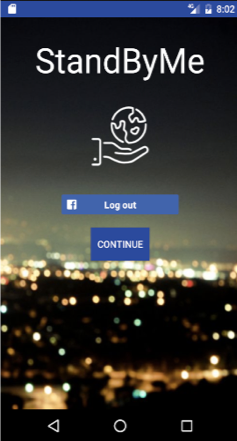
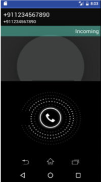
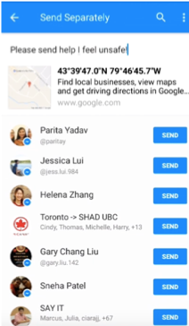

# standbyme

An Android app for prevention, protection and incrimination against harassment.
Created for the Facebook Global Hackathon Finals.

## Screen Shots
  

## Reflection
My team at the Facebook Global Hackathon Finals created StandByMe after hearing about a street harassment incident that occurred at a bus stop near our home. By utilizing the Facebook Messenger API and Google Speech to Text API, we were able to create an app that detects distress key words from the user and sends their location to a trusted Facebook friend. Our hack placed 4th overall.

